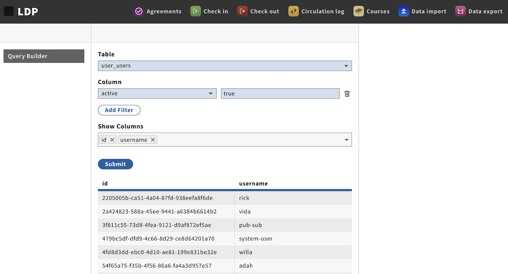

# ui-ldp

Copyright (C) 2020-2025 The Open Library Foundation

This software is distributed under the terms of the Apache License, Version 2.0. See the [LICENSE](LICENSE) file for more information.

<!-- md2toc -l 2 README.md -->
* [Introduction](#introduction)
* [Prerequisites for local development](#prerequisites-for-local-development)
* [Run](#run)
* [Side-loading mod-ldp](#side-loading-mod-ldp)
* [Configuration](#configuration)
    * [dbinfo](#dbinfo)
    * [Use of mod-configuration](#use-of-mod-configuration)
* [Permissions](#permissions)
* [Database issues](#database-issues)
* [Migrating saved queries from GitHub to mod-settings](#migrating-saved-queries-from-github-to-mod-settings)
* [Additional information](#additional-information)
    * [Other documentation](#other-documentation)
    * [Code of Conduct](#code-of-conduct)
    * [Issue tracker](#issue-tracker)


## Introduction

LDP query builder UI for FOLIO/ReShare.



Currently has one page, a Query Builder for the [Library Data Platform](https://github.com/library-data-platform/ldp) (LDP).

## Prerequisites for local development

- This repo is bootstrapped by the Stripes CLI, so an Okapi backend is required to be running to login. The [testing-backend](https://app.vagrantup.com/folio/boxes/testing-backend) Vagrant box will work.
- mod-ldp must be running and registered with Okapi

## Run

```
yarn start --okapi https://folio-snapshot-okapi.dev.folio.org
```

## Side-loading mod-ldp

If developing mod-ldp locally, it's desirable to make ui-ldp refer to the local instance rather than the one of the backend that is used for other FOLIO modules, such as mod-configuration and mod-users-bl. The conceptually simplest way to do this is to run the whole FOLIO stack locally, but this is complex in practice, and requires a vast amount of memory.

An alternative is to "side-load" the locally running copy of mod-ldp. This can be done by setting the Stripes configuration element `modLdpUrl` to the URL of the running instance -- for example, `http://localhost:8001` if running simply with `java -jar target/mod-ldp-0.0.1-SNAPSHOT.jar`.

_However_ ... it's never that easy, it? ... Done naively, this will fail because the browser's common origin policy will refuse to perform GETs and POST against servers such as mod-ldp that do not supply the `Access-Control-Allow-Origin: *` header in OPTIONS responses. In order to work around this, it's necessary to use a proxy that inserts this header, such as [Local CORS Anywhere](https://github.com/dkaoster/local-cors-anywhere), and to modify the `modLdpUrl` setting accordingly.

The `modLdpUrl` setting can be placed in a Stripes config file such as the supplied [`stripes.config.js`](stripes.config.js). To use it, ensure that its Okapi URL setting is correct, and run as
```
yarn start stripes.config.js
```

## Configuration

The LDP app is configured primarily by means of [mod-ldp's own configuration WSAPI](https://s3.amazonaws.com/foliodocs/api/mod-ldp/p/ldp.html), which functions as a simple key-value store in which the values are conventionally JSON strings. The following configuration entries are used:

### dbinfo

The value is a JSON structure of three keys specifying how to access the underlying LDP database.

* `url` -- the full URL to the LDP database, e.g. `jdbc:postgresql://some.domain.com:5432/ldp`
* `user` -- the username that should be used to access the database: the nominated user need only have read access to the relevant tables and indexes, and should not have additional and unnecessary write access for security reasons
* `pass` -- the password corresponding to this username

### Use of mod-configuration

For historical reasons, ui-ldp also makes use of mod-configuration to store two further peices of configuration information: the limits on how many records to show in search results, and the tables to be disabled for searching. Both of these should probably be moved to use mod-ldp's own configuration store.


## Permissions

For users who need only to search in the LDP, it suffices to assign the `module.ldp.enabled` permission ("UI: LDP module is enabled").

The `settings.ldp.enabled` permission ("Settings (LDP): Can view settings") should be assigned only to administrators, along with whichever specific `ui-ldp.settings.*` permissions are appropriate.


## Database issues

In the LDP database, the `srs_marctab` table uses a special index which is not yet supported by the LDP app, and as a result it could put a lot of load on the LDP database. To prevent this, go to **Settings** > **LDP** > **Table availability**m and under **Schema `public`**, check `srs_marctab`. This will disable that table in the LDP app. (In the future we plan for the LDP app to support the `srs_marctab` table fully.)

For any local tables that are visible in the LDP App, indexes should be created on all columns. Again this will avoid putting too much load on the database. In the future we plan for the LDP App to disable filtering automatically on columns that do not have indexes (see [UILDP-52](https://issues.folio.org/browse/UILDP-52).)


## Migrating saved queries from GitHub to mod-settings

From v1.6.0 until 1.9.0, this module supported saved queries which were stored in GitHub repositories. As of v1.10.0, queries are now stored in FOLIO itself, using mod-settings. When migrating from an older version of ui-courses to v1.10.0 or higher, it is necessary to migrate the existing saved queries from GitHub to mod-settings. [The `folio-port-ldp-queries` script](bin) is provided to do this.


## Additional information

### Other documentation

[Library Data Platform](https://github.com/library-data-platform/ldp) (LDP)
-- an open source platform for analytics in libraries.

[mod-ldp](https://github.com/folio-org/mod-ldp)
-- LDP query builder server-side module for FOLIO/ReShare.

### Code of Conduct

Refer to the Wiki [FOLIO Code of Conduct](https://wiki.folio.org/display/COMMUNITY/FOLIO+Code+of+Conduct).

### Issue tracker

Issues are tracked in [the JIRA issue UILFP](https://issues.folio.org/projects/UILDP).


